# Awesome Multimodal Agentic Retrieval

[](https://github.com/Reflection0427/Awesome-Multimodal-Agentic-Retrieval/actions/workflows/discover-papers.yml)
[](https://github.com/Reflection0427/Awesome-Multimodal-Agentic-Retrieval/actions/workflows/validate.yml)

A curated collection of papers on **multimodal retrieval, multimodal RAG, visual-document retrieval, and agentic multimodal search**.

本仓库关注“大模型如何参与多模态检索，以及检索如何增强多模态大模型与 Agent”。每篇正式收录论文后均展示从官方 PDF 裁取的**论文作者原始 Figure**，并标注 Figure 编号、官方来源和权利归属；仓库不使用 AI 生成图或自绘框架图。

**37 papers · through 2026 · weekly candidate PRs · human-reviewed merges**

## Scope

Included: MLLM retrievers and rerankers, multimodal embeddings, multimodal RAG, visual-document retrieval, multimodal browsing/search agents, and directly related surveys or benchmarks.

Excluded: conventional image-text retrieval without a large-model or agent component, multimodal generation without external retrieval, and GUI agents unrelated to information retrieval.

## Contents

- [Surveys and Roadmaps (5)](#surveys-and-roadmaps)
- [Foundations (5)](#foundations)
- [Universal Multimodal Retrievers (4)](#universal-multimodal-retrievers)
- [Visual Document Retrieval and RAG (14)](#visual-document-retrieval-and-rag)
- [Agentic Multimodal Search (9)](#agentic-multimodal-search)
- [Benchmarks](#benchmarks)
- [Automatic paper tracking](#automatic-paper-tracking)
- [Contributing](#contributing)

## Surveys and Roadmaps

综述、分类体系与研究路线图。

### A Survey of Large Language Model-Based Search Agents

**ACL 2026** · [Paper](https://aclanthology.org/2026.acl-long.374/)

A roadmap for LLM search agents, covering planning, retrieval, reasoning and evaluation.

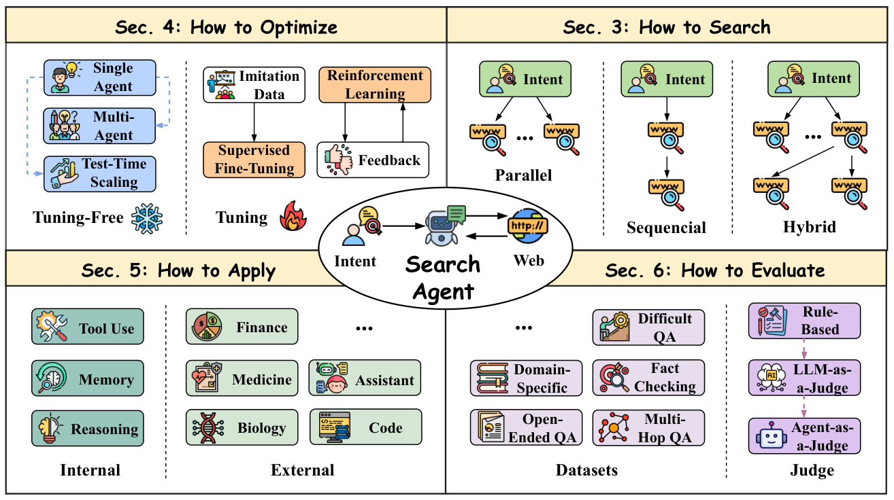

<sub>Original paper figure: <strong>Figure 2</strong> · <a href="https://aclanthology.org/2026.acl-long.374.pdf">Source: official PDF</a> · Credit: Yunjia Xi et al. · © Paper authors/publisher. All rights remain with the original owner. · <a href="https://creativecommons.org/licenses/by/4.0/">License</a></sub>

### Scaling Beyond Context: A Survey of Multimodal Retrieval-Augmented Generation for Document Understanding

**ACL 2026** · [Paper](https://aclanthology.org/2026.acl-long.204/) · [Code / Project](https://github.com/SensenGao/Multimodal-RAG-Survey-For-Document)

A survey of multimodal RAG for long and visually rich document understanding.

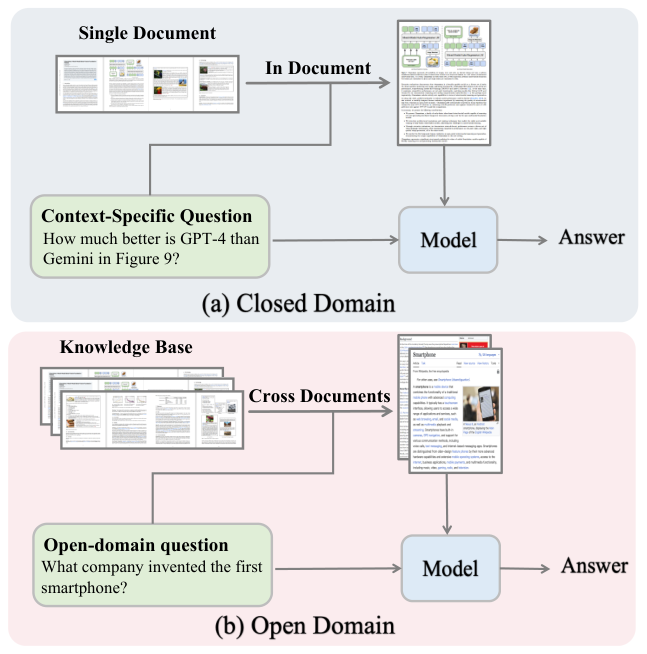

<sub>Original paper figure: <strong>Figure 2</strong> · <a href="https://aclanthology.org/2026.acl-long.204.pdf">Source: official PDF</a> · Credit: Sensen Gao et al. · © Paper authors/publisher. All rights remain with the original owner. · <a href="https://creativecommons.org/licenses/by/4.0/">License</a></sub>

### Ask in Any Modality: A Comprehensive Survey on Multimodal Retrieval-Augmented Generation

**Findings of ACL 2025** · [Paper](https://aclanthology.org/2025.findings-acl.861/) · [Code / Project](https://github.com/llm-lab-org/Multimodal-RAG-Survey)

A comprehensive taxonomy of multimodal RAG datasets, retrieval, fusion, generation and agentic methods.

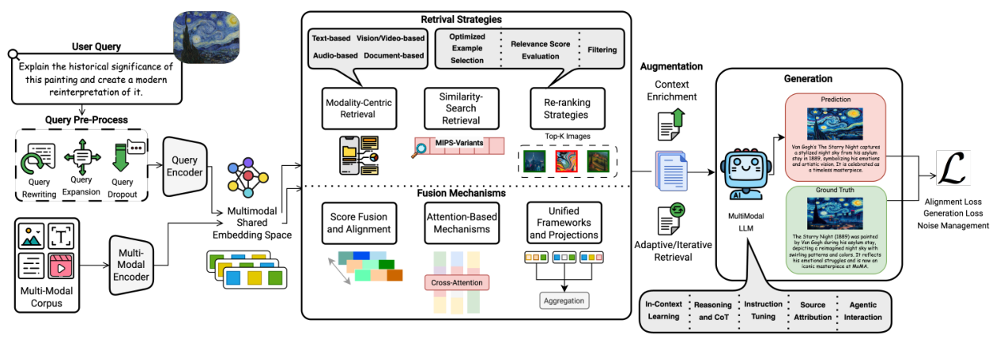

<sub>Original paper figure: <strong>Figure 1</strong> · <a href="https://aclanthology.org/2025.findings-acl.861.pdf">Source: official PDF</a> · Credit: Mohammad Mahdi Abootorabi et al. · © Paper authors/publisher. All rights remain with the original owner. · <a href="https://creativecommons.org/licenses/by/4.0/">License</a></sub>

### Roles of Multimodal Large Language Models in Visually Rich Document Retrieval for RAG: A Survey

**IJCNLP-AACL 2025** · [Paper](https://aclanthology.org/2025.ijcnlp-long.2/)

Organizes MLLM-based document retrieval into captioning, embedding and end-to-end page representation paradigms.

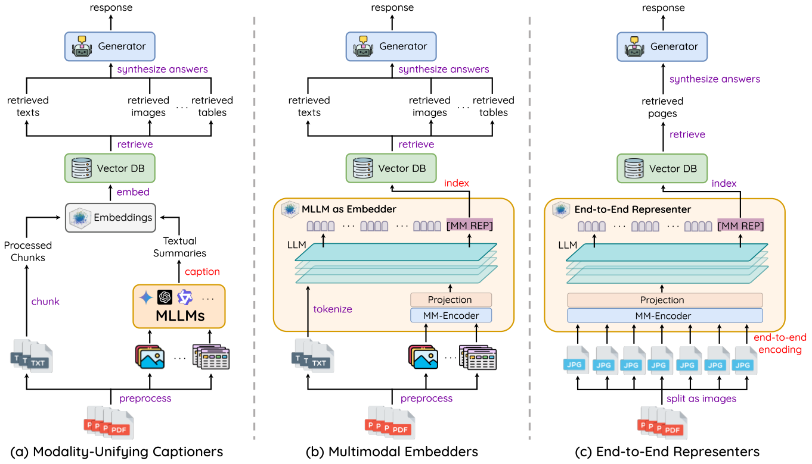

<sub>Original paper figure: <strong>Figure 1</strong> · <a href="https://aclanthology.org/2025.ijcnlp-long.2.pdf">Source: official PDF</a> · Credit: Xiantao Zhang · © Paper authors/publisher. All rights remain with the original owner. · <a href="https://creativecommons.org/licenses/by/4.0/">License</a></sub>

### Retrieving Multimodal Information for Augmented Generation: A Survey

**Findings of EMNLP 2023** · [Paper](https://aclanthology.org/2023.findings-emnlp.314/)

An early systematic review of retrieving multimodal information to augment generation.

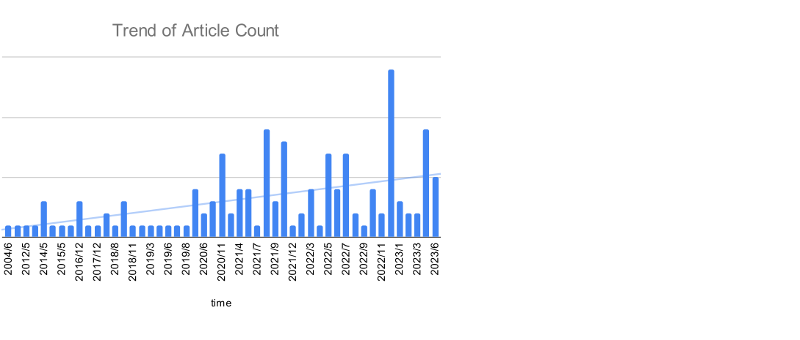

<sub>Original paper figure: <strong>Figure 1</strong> · <a href="https://aclanthology.org/2023.findings-emnlp.314.pdf">Source: official PDF</a> · Credit: Ruochen Zhao et al. · © Paper authors/publisher. All rights remain with the original owner. · <a href="https://creativecommons.org/licenses/by/4.0/">License</a></sub>

## Foundations

检索增强视觉语言模型与多模态生成的奠基工作。

### Retrieval-Augmented Multimodal Language Modeling

**ICML 2023** · [Paper](https://arxiv.org/abs/2211.12561)

RA-CM3 augments an autoregressive multimodal model with retrieved image-text memory.

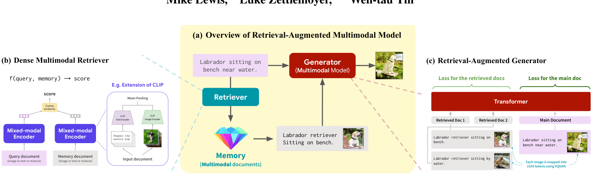

<sub>Original paper figure: <strong>Figure 1</strong> · <a href="https://arxiv.org/pdf/2211.12561v2">Source: official PDF</a> · Credit: Michihiro Yasunaga et al. · © Paper authors/publisher. All rights remain with the original owner.</sub>

### REVEAL: Retrieval-Augmented Visual-Language Pre-Training with Multi-Source Multimodal Knowledge Memory

**CVPR 2023** · [Paper](https://openaccess.thecvf.com/content/CVPR2023/html/Hu_REVEAL_Retrieval-Augmented_Visual-Language_Pre-Training_With_Multi-Source_Multimodal_Knowledge_Memory_CVPR_2023_paper.html) · [Code / Project](https://reveal-cvpr.github.io/)

Retrieves evidence from multi-source multimodal memory for visual-language pre-training and downstream tasks.

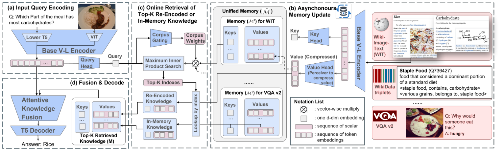

<sub>Original paper figure: <strong>Figure 2</strong> · <a href="https://openaccess.thecvf.com/content/CVPR2023/papers/Hu_REVEAL_Retrieval-Augmented_Visual-Language_Pre-Training_With_Multi-Source_Multimodal_Knowledge_Memory_CVPR_2023_paper.pdf">Source: official PDF</a> · Credit: Ziniu Hu et al. · © Paper authors/publisher. All rights remain with the original owner.</sub>

### Scaling Autoregressive Multi-Modal Models: Pretraining and Instruction Tuning

**arXiv 2023** · [Paper](https://arxiv.org/abs/2309.02591)

CM3Leon combines retrieval-augmented pre-training with multimodal instruction tuning.

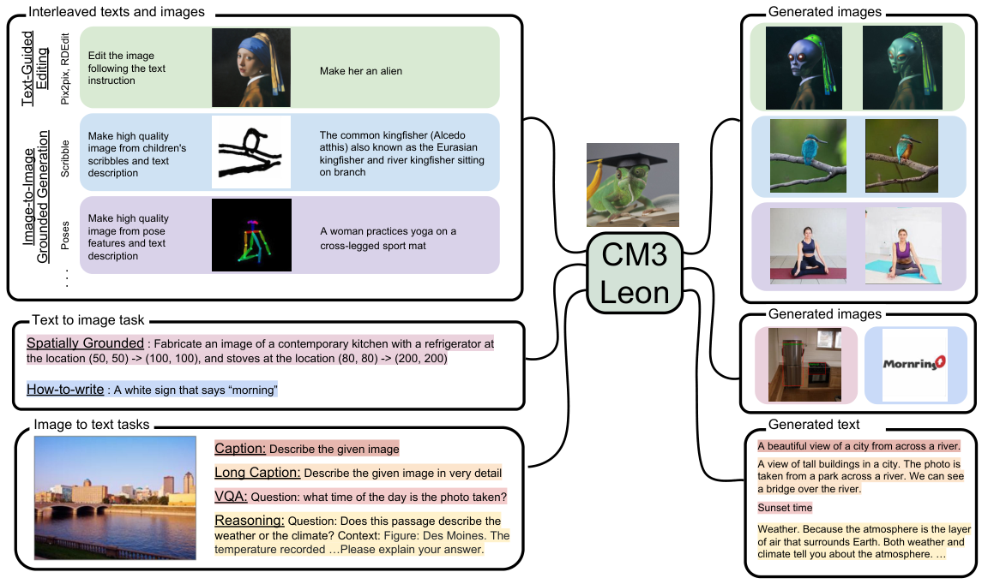

<sub>Original paper figure: <strong>Figure 5</strong> · <a href="https://arxiv.org/pdf/2309.02591v1">Source: official PDF</a> · Credit: Lili Yu et al. · © Paper authors/publisher. All rights remain with the original owner.</sub>

### KAT: A Knowledge Augmented Transformer for Vision-and-Language

**NAACL 2022** · [Paper](https://arxiv.org/abs/2112.08614) · [Code / Project](https://github.com/guilk/KAT)

Combines implicit model knowledge with retrieved explicit knowledge for knowledge-based VQA.

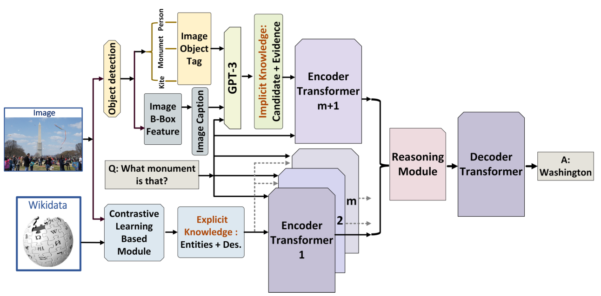

<sub>Original paper figure: <strong>Figure 2</strong> · <a href="https://arxiv.org/pdf/2112.08614v2">Source: official PDF</a> · Credit: Liangke Gui et al. · © Paper authors/publisher. All rights remain with the original owner.</sub>

### MuRAG: Multimodal Retrieval-Augmented Generator for Open Question Answering over Images and Text

**EMNLP 2022** · [Paper](https://aclanthology.org/2022.emnlp-main.375/)

Jointly retrieves textual and visual evidence for open-domain multimodal question answering.

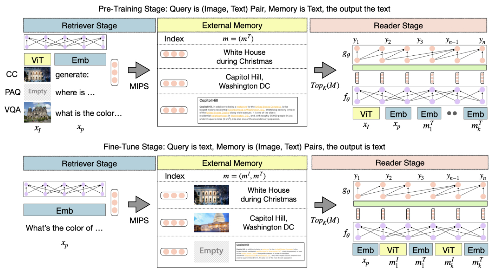

<sub>Original paper figure: <strong>Figure 4</strong> · <a href="https://aclanthology.org/2022.emnlp-main.375.pdf">Source: official PDF</a> · Credit: Wenhu Chen et al. · © Paper authors/publisher. All rights remain with the original owner. · <a href="https://creativecommons.org/licenses/by/4.0/">License</a></sub>

## Universal Multimodal Retrievers

由 MLLM 驱动的统一检索器、Embedding 与推理型检索基准。

### MMEB-V3: Measuring Performance Gaps of Omni-Modality Embedding Models

**arXiv 2026** · [Paper](https://arxiv.org/abs/2604.23321)

Evaluates omni-modality embedding models across text, image, video, audio and agent-centric tasks.

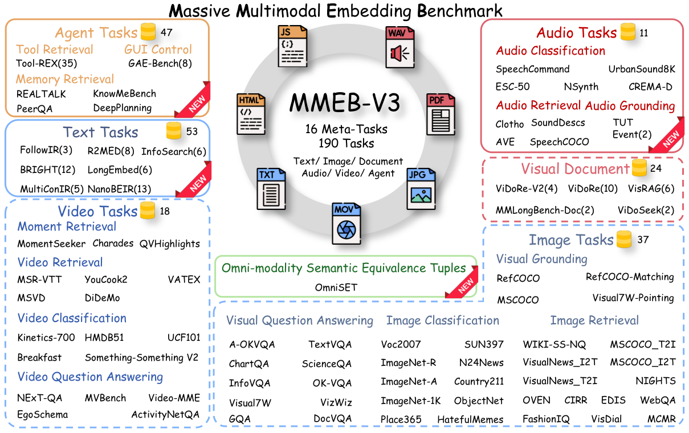

<sub>Original paper figure: <strong>Figure 1</strong> · <a href="https://arxiv.org/pdf/2604.23321v2">Source: official PDF</a> · Credit: Haohang Huang et al. · © Paper authors/publisher. All rights remain with the original owner.</sub>

### RMIR: A Benchmark Dataset for Reasoning-Intensive Multimodal Image Retrieval

**CVPR 2026** · [Paper](https://openaccess.thecvf.com/content/CVPR2026/papers/Li_RMIR_A_Benchmark_Dataset_for_Reasoning-Intensive_Multimodal_Image_Retrieval_CVPR_2026_paper.pdf)

Benchmarks image retrieval that requires compositional and multi-step reasoning rather than surface similarity.

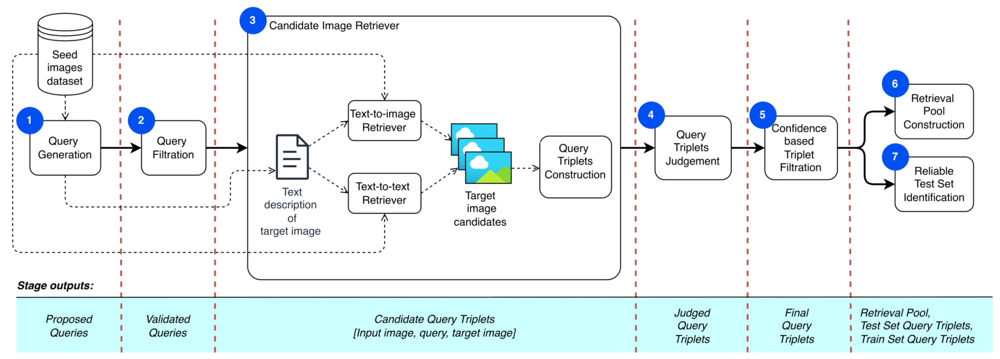

<sub>Original paper figure: <strong>Figure 2</strong> · <a href="https://openaccess.thecvf.com/content/CVPR2026/papers/Li_RMIR_A_Benchmark_Dataset_for_Reasoning-Intensive_Multimodal_Image_Retrieval_CVPR_2026_paper.pdf">Source: official PDF</a> · Credit: Yijiang Li et al. · © Paper authors/publisher. All rights remain with the original owner.</sub>

### MM-Embed: Universal Multimodal Retrieval with Multimodal LLMs

**arXiv 2024** · [Paper](https://arxiv.org/abs/2411.02571)

Turns an MLLM into a universal bi-encoder using modality-aware hard negatives and reranking.

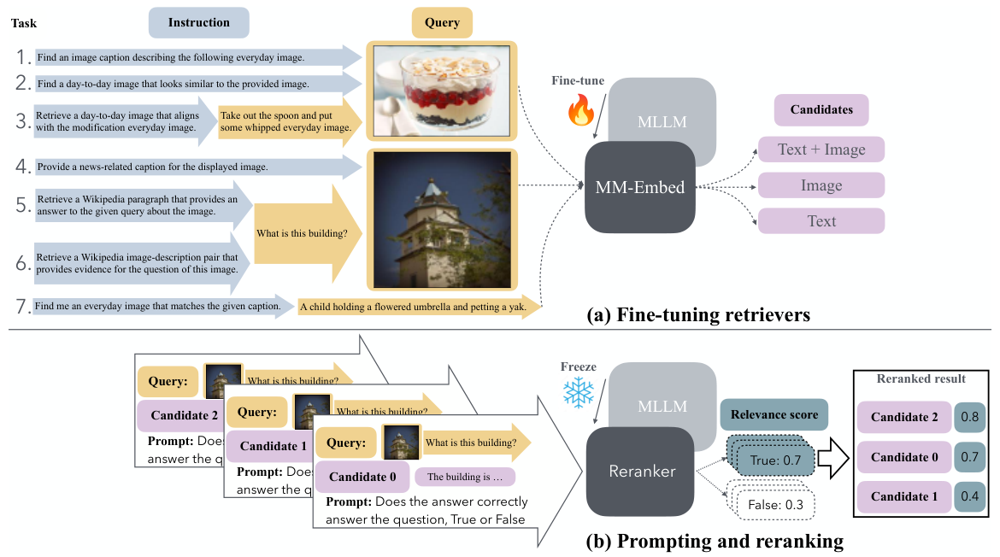

<sub>Original paper figure: <strong>Figure 1</strong> · <a href="https://arxiv.org/pdf/2411.02571v2">Source: official PDF</a> · Credit: Sheng-Chieh Lin et al. · © Paper authors/publisher. All rights remain with the original owner.</sub>

### UniIR: Training and Benchmarking Universal Multimodal Information Retrievers

**ECCV 2024** · [Paper](https://arxiv.org/abs/2311.17136) · [Code / Project](https://github.com/TIGER-AI-Lab/UniIR)

Introduces a unified multimodal retriever and the multi-task M-BEIR benchmark.

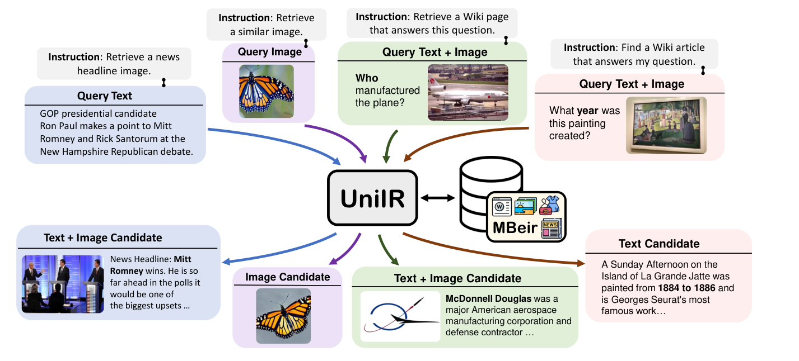

<sub>Original paper figure: <strong>Figure 1</strong> · <a href="https://arxiv.org/pdf/2311.17136v1">Source: official PDF</a> · Credit: Cong Wei et al. · © Paper authors/publisher. All rights remain with the original owner.</sub>

## Visual Document Retrieval and RAG

面向页面图像、布局、图表和长文档的检索增强生成。

### LAD-RAG: Layout-aware Dynamic RAG for Visually-Rich Document Understanding

**ACL 2026** · [Paper](https://aclanthology.org/2026.acl-long.724/)

Uses document layout to dynamically retrieve evidence from visually rich pages.

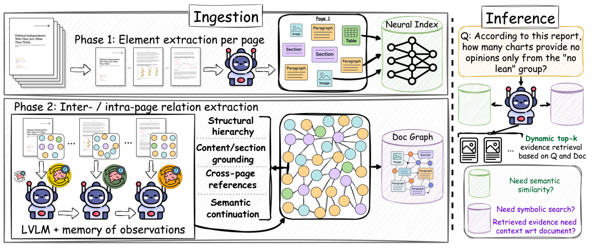

<sub>Original paper figure: <strong>Figure 2</strong> · <a href="https://aclanthology.org/2026.acl-long.724.pdf">Source: official PDF</a> · Credit: Zhivar Sourati et al. · © Paper authors/publisher. All rights remain with the original owner. · <a href="https://creativecommons.org/licenses/by/4.0/">License</a></sub>

### MDocRAG-RL: Empowering Multi-Modal Document RAG via Complex Visual Reasoning with Reinforcement Learning

**Findings of ACL 2026** · [Paper](https://aclanthology.org/2026.findings-acl.420/)

Applies reinforcement learning to complex visual reasoning in multimodal document RAG.

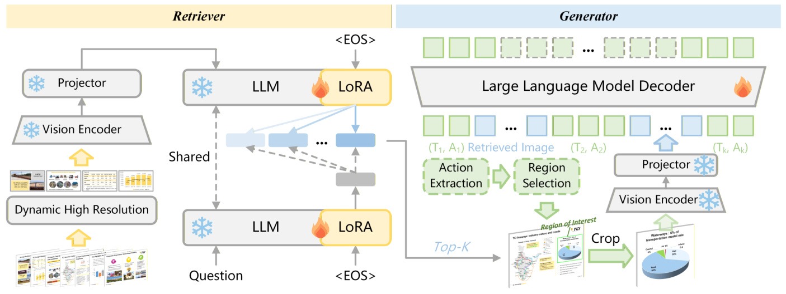

<sub>Original paper figure: <strong>Figure 2</strong> · <a href="https://aclanthology.org/2026.findings-acl.420.pdf">Source: official PDF</a> · Credit: Zhongyu Wang · © Paper authors/publisher. All rights remain with the original owner. · <a href="https://creativecommons.org/licenses/by/4.0/">License</a></sub>

### MegaRAG: Multimodal Knowledge Graph-Based Retrieval-Augmented Generation

**ACL 2026** · [Paper](https://aclanthology.org/2026.acl-long.2218/)

Organizes heterogeneous multimodal evidence as a knowledge graph for retrieval and generation.

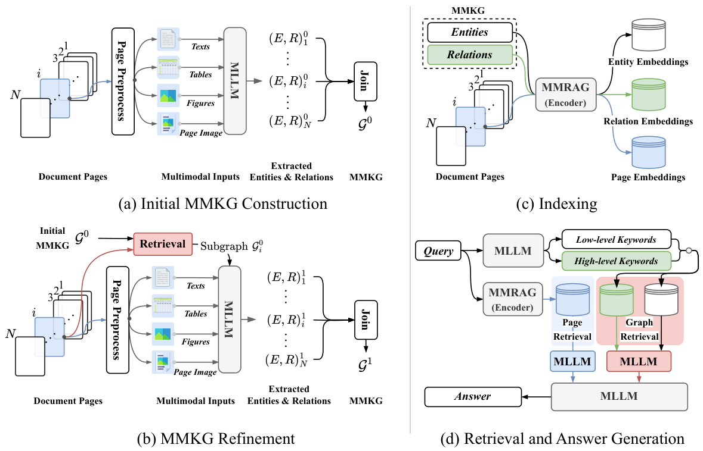

<sub>Original paper figure: <strong>Figure 1</strong> · <a href="https://aclanthology.org/2026.acl-long.2218.pdf">Source: official PDF</a> · Credit: Chi-Hsiang Hsiao et al. · © Paper authors/publisher. All rights remain with the original owner. · <a href="https://creativecommons.org/licenses/by/4.0/">License</a></sub>

### Progressive Re-ranking for Multimodal Retrieval-Augmented Generation via Curriculum Learning

**Findings of ACL 2026** · [Paper](https://aclanthology.org/2026.findings-acl.2045/)

Learns a multimodal reranker progressively through curriculum learning.

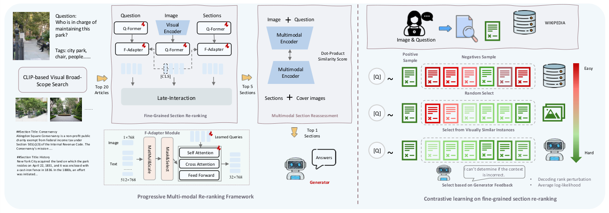

<sub>Original paper figure: <strong>Figure 2</strong> · <a href="https://aclanthology.org/2026.findings-acl.2045.pdf">Source: official PDF</a> · Credit: Zhu Min et al. · © Paper authors/publisher. All rights remain with the original owner. · <a href="https://creativecommons.org/licenses/by/4.0/">License</a></sub>

### RobustVisRAG: Causality-Aware Vision-Based Retrieval-Augmented Generation under Visual Degradations

**CVPR 2026** · [Paper](https://openaccess.thecvf.com/content/CVPR2026/html/Chen_RobustVisRAG_Causality-Aware_Vision-Based_Retrieval-Augmented_Generation_under_Visual_Degradations_CVPR_2026_paper.html)

Improves vision-based RAG robustness under noisy and degraded document images.

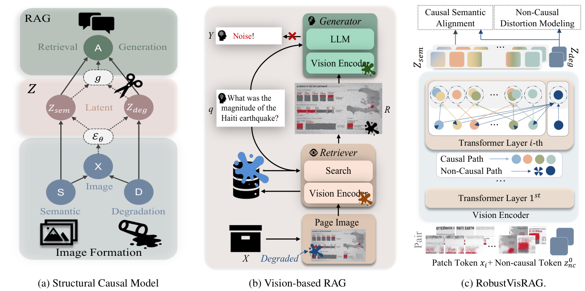

<sub>Original paper figure: <strong>Figure 2</strong> · <a href="https://openaccess.thecvf.com/content/CVPR2026/papers/Chen_RobustVisRAG_Causality-Aware_Vision-Based_Retrieval-Augmented_Generation_under_Visual_Degradations_CVPR_2026_paper.pdf">Source: official PDF</a> · Credit: I-Hsiang Chen et al. · © Paper authors/publisher. All rights remain with the original owner.</sub>

### ColMATE: Multi-modal Retrieval Embedding for Visually-rich Documents

**EMNLP Industry 2025** · [Paper](https://aclanthology.org/2025.emnlp-industry.145/)

Learns efficient multimodal retrieval embeddings for visually rich documents.

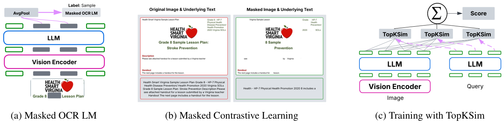

<sub>Original paper figure: <strong>Figure 1</strong> · <a href="https://aclanthology.org/2025.emnlp-industry.145.pdf">Source: official PDF</a> · Credit: Ahmed Masry et al. · © Paper authors/publisher. All rights remain with the original owner. · <a href="https://creativecommons.org/licenses/by/4.0/">License</a></sub>

### End-to-End Optimization for Multimodal Retrieval-Augmented Generation via Reward Backpropagation

**Findings of EMNLP 2025** · [Paper](https://aclanthology.org/2025.findings-emnlp.24/)

Uses downstream generation reward to optimize the multimodal retriever end to end.

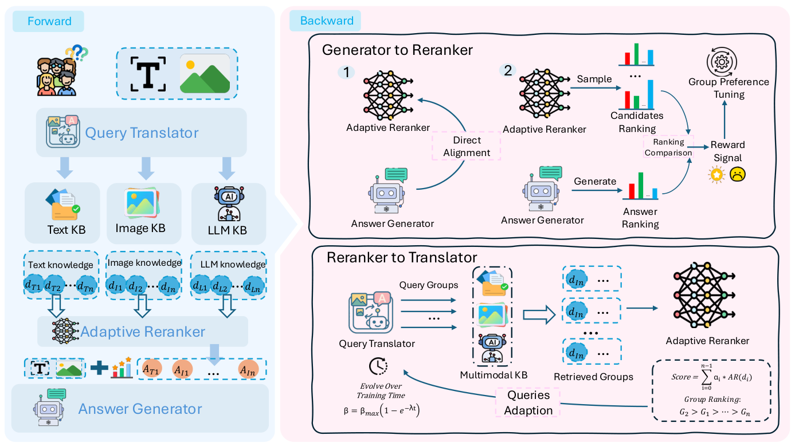

<sub>Original paper figure: <strong>Figure 2</strong> · <a href="https://aclanthology.org/2025.findings-emnlp.24.pdf">Source: official PDF</a> · Credit: Zhiyuan Fan et al. · © Paper authors/publisher. All rights remain with the original owner. · <a href="https://creativecommons.org/licenses/by/4.0/">License</a></sub>

### MMDocIR: Benchmarking Multi-Modal Retrieval for Long Documents

**EMNLP 2025** · [Paper](https://aclanthology.org/2025.emnlp-main.1576/) · [Code / Project](https://mmdocrag.github.io/MMDocIR/)

Benchmarks retrieval from long documents containing text and visually rich content.

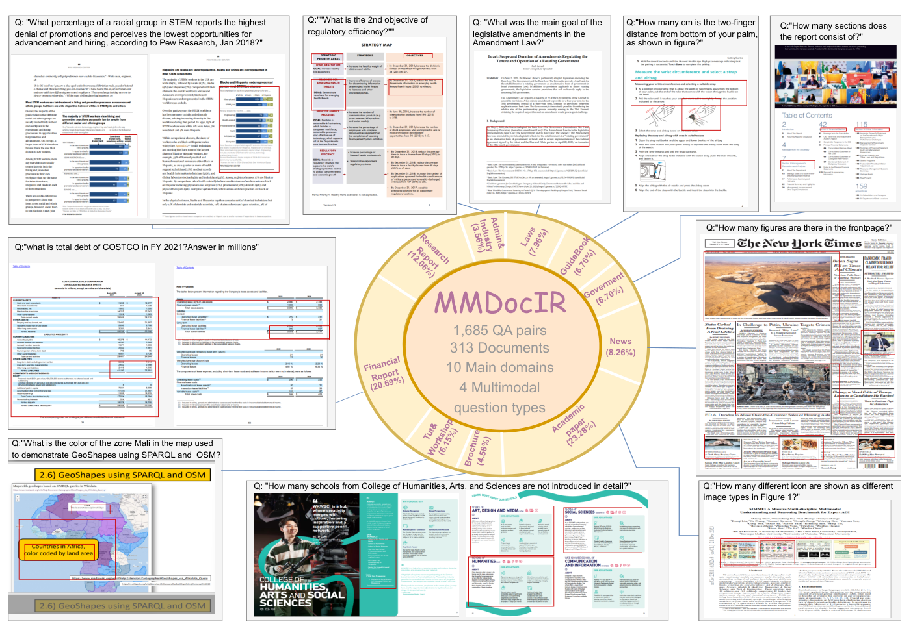

<sub>Original paper figure: <strong>Figure 1</strong> · <a href="https://aclanthology.org/2025.emnlp-main.1576.pdf">Source: official PDF</a> · Credit: Kuicai Dong et al. · © Paper authors/publisher. All rights remain with the original owner. · <a href="https://creativecommons.org/licenses/by/4.0/">License</a></sub>

### MMDocRAG: Benchmarking Retrieval-Augmented Generation for Multi-Modal Document Understanding

**NeurIPS 2025 Datasets and Benchmarks** · [Paper](https://arxiv.org/abs/2505.16470)

Jointly evaluates multimodal document retrieval and answer generation.

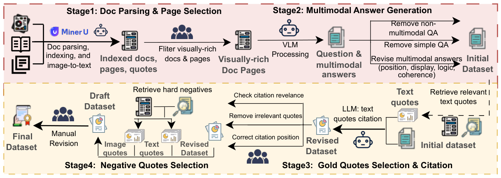

<sub>Original paper figure: <strong>Figure 3</strong> · <a href="https://arxiv.org/pdf/2505.16470v2">Source: official PDF</a> · Credit: Kuicai Dong et al. · © Paper authors/publisher. All rights remain with the original owner.</sub>

### VDocRAG: Retrieval-Augmented Generation over Visually-Rich Documents

**CVPR 2025** · [Paper](https://openaccess.thecvf.com/content/CVPR2025/papers/Tanaka_VDocRAG_Retrieval-Augmented_Generation_over_Visually-Rich_Documents_CVPR_2025_paper.pdf)

Builds an end-to-end retrieval and generation pipeline over visually rich documents.

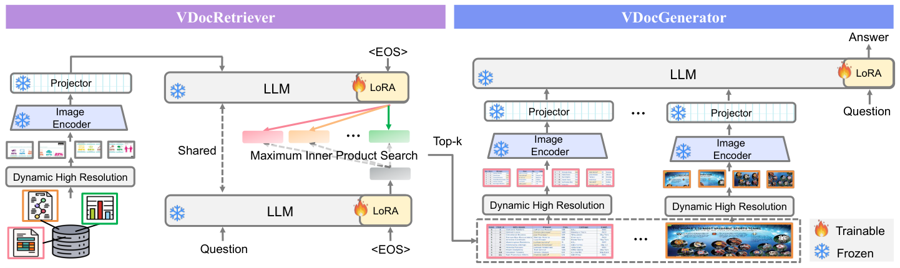

<sub>Original paper figure: <strong>Figure 3</strong> · <a href="https://openaccess.thecvf.com/content/CVPR2025/papers/Tanaka_VDocRAG_Retrieval-Augmented_Generation_over_Visually-Rich_Documents_CVPR_2025_paper.pdf">Source: official PDF</a> · Credit: Ryota Tanaka et al. · © Paper authors/publisher. All rights remain with the original owner.</sub>

### ViDoRAG: Visual Document Retrieval-Augmented Generation via Dynamic Iterative Reasoning Agents

**EMNLP 2025** · [Paper](https://aclanthology.org/2025.emnlp-main.464/) · [Code / Project](https://github.com/Alibaba-NLP/ViDoRAG)

Coordinates Seeker, Inspector and Answer agents for iterative visual-document retrieval and verification.


<sub>Original paper figure: <strong>Figure 3</strong> · <a href="https://aclanthology.org/2025.emnlp-main.464.pdf">Source: official PDF</a> · Credit: Qiuchen Wang et al. · © Paper authors/publisher. All rights remain with the original owner. · <a href="https://creativecommons.org/licenses/by/4.0/">License</a></sub>

### VisDoM: Multi-Document QA with Visually Rich Elements Using Multimodal RAG

**NAACL 2025** · [Paper](https://aclanthology.org/2025.naacl-long.310/)

Retrieves and reasons across multiple documents containing text, charts, images and layout cues.

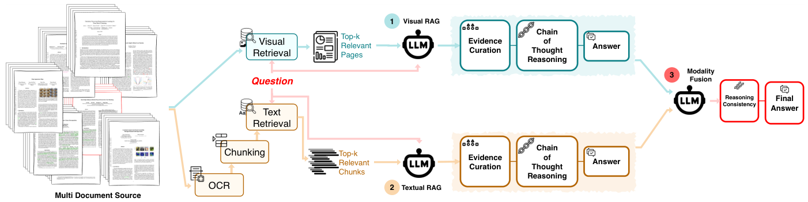

<sub>Original paper figure: <strong>Figure 2</strong> · <a href="https://aclanthology.org/2025.naacl-long.310.pdf">Source: official PDF</a> · Credit: Manan Suri et al. · © Paper authors/publisher. All rights remain with the original owner. · <a href="https://creativecommons.org/licenses/by/4.0/">License</a></sub>

### VisRAG: Vision-based Retrieval-augmented Generation on Multi-modality Documents

**ICLR 2025** · [Paper](https://arxiv.org/abs/2410.10594) · [Code / Project](https://github.com/openbmb/visrag)

Retrieves directly over document-page images to preserve layout and visual information lost by OCR pipelines.

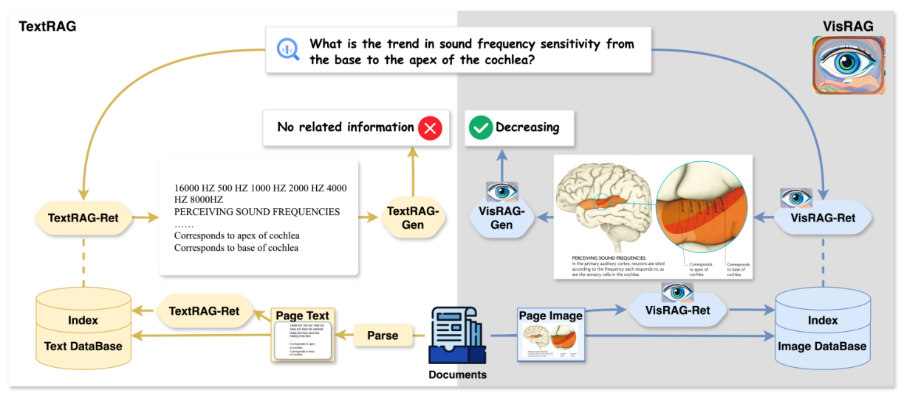

<sub>Original paper figure: <strong>Figure 2</strong> · <a href="https://arxiv.org/pdf/2410.10594v2">Source: official PDF</a> · Credit: Shi Yu et al. · © Paper authors/publisher. All rights remain with the original owner.</sub>

### ColPali: Efficient Document Retrieval with Vision Language Models

**arXiv 2024** · [Paper](https://arxiv.org/abs/2407.01449) · [Code / Project](https://github.com/illuin-tech/colpali)

Represents page screenshots with VLM patch embeddings and ranks them using late interaction.

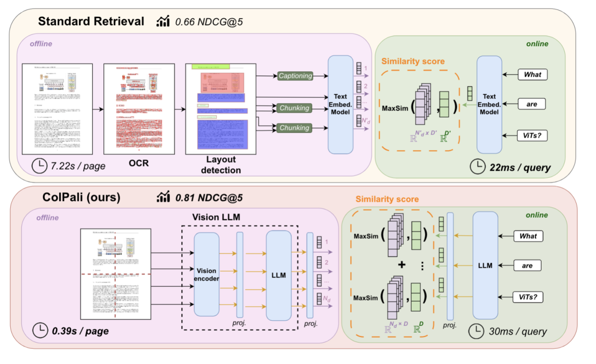

<sub>Original paper figure: <strong>Figure 1</strong> · <a href="https://arxiv.org/pdf/2407.01449v6">Source: official PDF</a> · Credit: Manuel Faysse et al. · © Paper authors/publisher. All rights remain with the original owner.</sub>

## Agentic Multimodal Search

能够规划、迭代检索、检查证据并核验来源的多模态 Agent。

### DeepImageSearch: Benchmarking Multimodal Agents for Context-Aware Image Retrieval in Visual Histories

**arXiv 2026** · [Paper](https://arxiv.org/abs/2602.10809)

Benchmarks agents that retrieve images by reasoning over long visual histories and context.


<sub>Original paper figure: <strong>Figure 3</strong> · <a href="https://arxiv.org/pdf/2602.10809v2">Source: official PDF</a> · Credit: Chenlong Deng et al. · © Paper authors/publisher. All rights remain with the original owner.</sub>

### Fix Before Search: Benchmarking Agentic Visual Query Pre-processing in Multimodal RAG

**ICML 2026** · [Paper](https://proceedings.mlr.press/v306/zeng26w.html) · [Code / Project](https://github.com/phycholosogy/VQQP_Bench)

Benchmarks agents that repair, crop and enhance visual queries before retrieval.

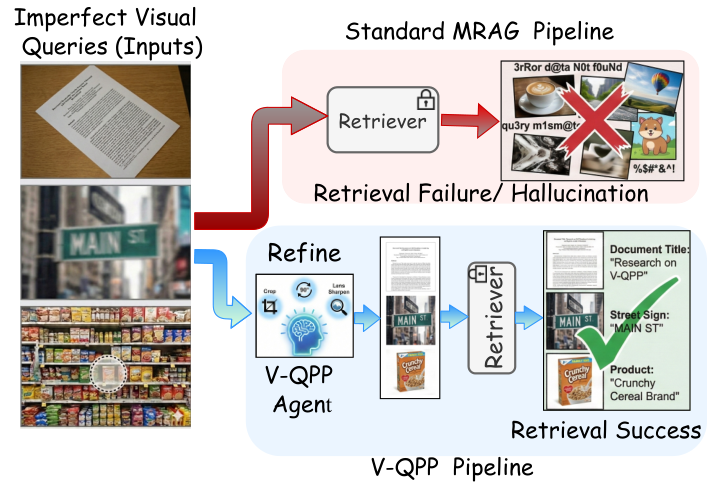

<sub>Original paper figure: <strong>Figure 1</strong> · <a href="https://raw.githubusercontent.com/mlresearch/v306/main/assets/zeng26w/zeng26w.pdf">Source: official PDF</a> · Credit: Shenglai Zeng et al. · © Paper authors/publisher. All rights remain with the original owner.</sub>

### MC-Search: Evaluating and Enhancing Multimodal Agentic Search with Structured Long Reasoning Chains

**ICLR 2026** · [Paper](https://arxiv.org/abs/2603.00873) · [Code / Project](https://mc-search-project.github.io/)

Introduces structured long reasoning chains for evaluating and improving multimodal agentic search.


<sub>Original paper figure: <strong>Figure 2</strong> · <a href="https://arxiv.org/pdf/2603.00873v1">Source: official PDF</a> · Credit: Xuying Ning et al. · © Paper authors/publisher. All rights remain with the original owner.</sub>

### MMSearch-Plus: Benchmarking Provenance-Aware Search for Multimodal Browsing Agents

**ICLR 2026** · [Paper](https://arxiv.org/abs/2508.21475) · [Code / Project](https://github.com/mmsearch-plus/MMSearch-Plus)

Evaluates iterative text-image browsing, answer accuracy and provenance verification.

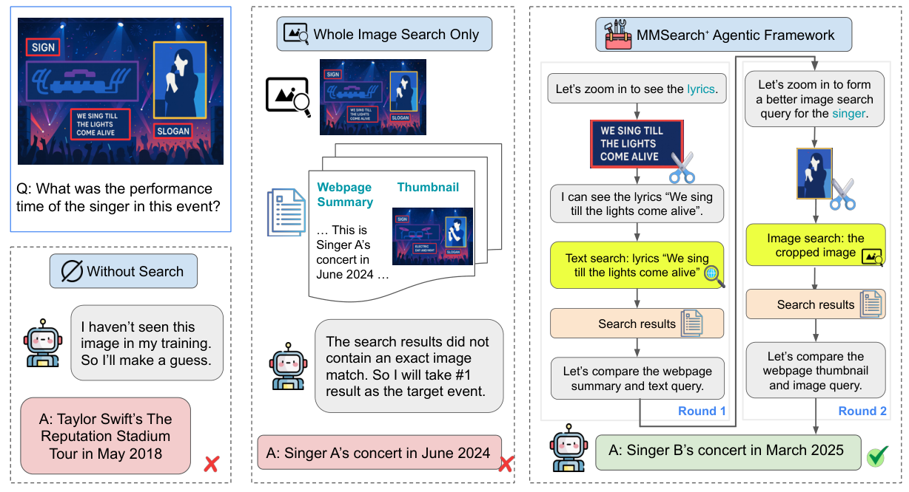

<sub>Original paper figure: <strong>Figure 1</strong> · <a href="https://arxiv.org/pdf/2508.21475v3">Source: official PDF</a> · Credit: Xijia Tao et al. · © Paper authors/publisher. All rights remain with the original owner.</sub>

### Reason Before You Retrieve: Agentic Planning for Multi-modal RAG

**arXiv 2026** · [Paper](https://arxiv.org/abs/2607.22643)

Models user intent before retrieval and maintains a structured KnowledgeMap for subsequent search.


<sub>Original paper figure: <strong>Figure 1</strong> · <a href="https://arxiv.org/pdf/2607.22643v1">Source: official PDF</a> · Credit: Tianyu Yang et al. · © Paper authors/publisher. All rights remain with the original owner.</sub>

### V-Retrver: Evidence-Driven Agentic Reasoning for Universal Multimodal Retrieval

**arXiv 2026** · [Paper](https://arxiv.org/abs/2602.06034)

Uses evidence-driven agent reasoning to solve universal multimodal retrieval tasks.


<sub>Original paper figure: <strong>Figure 2</strong> · <a href="https://arxiv.org/pdf/2602.06034v4">Source: official PDF</a> · Credit: Dongyang Chen et al. · © Paper authors/publisher. All rights remain with the original owner.</sub>

### VLD-RAG: Agentic Vision-Language RAG for Long, Visually Rich Multi-Page Documents

**arXiv 2026** · [Paper](https://arxiv.org/abs/2607.24748)

Uses an agentic vision-language pipeline to retrieve and reason over long multi-page documents.


<sub>Original paper figure: <strong>Figure 1</strong> · <a href="https://arxiv.org/pdf/2607.24748v1">Source: official PDF</a> · Credit: Seonok Kim · © Paper authors/publisher. All rights remain with the original owner.</sub>

### WeAgent-MMSearch: Native Text-Vision Interaction for Multimodal Search Agents

**arXiv 2026** · [Paper](https://arxiv.org/abs/2608.28062)

Studies native text-vision interaction and visual-target localization for multimodal search agents.


<sub>Original paper figure: <strong>Figure 3</strong> · <a href="https://arxiv.org/pdf/2608.28062v2">Source: official PDF</a> · Credit: Zongkai Liu et al. · © Paper authors/publisher. All rights remain with the original owner.</sub>

### CollEX: A Multimodal Agentic RAG System Enabling Interactive Exploration of Scientific Collections

**MAGMaR at SIGIR 2025** · [Paper](https://aclanthology.org/2025.magmar-1.2/)

Supports interactive exploration of scientific collections using multimodal agentic RAG.


<sub>Original paper figure: <strong>Figure 4</strong> · <a href="https://aclanthology.org/2025.magmar-1.2.pdf">Source: official PDF</a> · Credit: Florian Schneider et al. · © Paper authors/publisher. All rights remain with the original owner. · <a href="https://creativecommons.org/licenses/by/4.0/">License</a></sub>

## Benchmarks

| Benchmark | Focus | Paper |
|---|---|---|
| M-BEIR | Universal multi-task, cross-modal retrieval | [UniIR](https://arxiv.org/abs/2311.17136) |
| ViDoRe | Visual document page retrieval | [ColPali](https://arxiv.org/abs/2407.01449) |
| MMDocIR | Long multimodal document retrieval | [MMDocIR](https://aclanthology.org/2025.emnlp-main.1576/) |
| MMDocRAG | Joint document retrieval and generation | [MMDocRAG](https://arxiv.org/abs/2505.16470) |
| MC-Search | Multimodal agentic search and long reasoning chains | [MC-Search](https://arxiv.org/abs/2603.00873) |
| MMSearch-Plus | Browsing, provenance and evidence verification | [MMSearch-Plus](https://arxiv.org/abs/2508.21475) |
| RMIR | Reasoning-intensive image retrieval | [RMIR](https://openaccess.thecvf.com/content/CVPR2026/papers/Li_RMIR_A_Benchmark_Dataset_for_Reasoning-Intensive_Multimodal_Image_Retrieval_CVPR_2026_paper.pdf) |
| VQQP-Bench | Agentic visual-query preprocessing | [Fix Before Search](https://proceedings.mlr.press/v306/zeng26w.html) |

## Automatic paper tracking

The scheduled workflow searches arXiv, OpenAlex and Crossref every Monday. It normalizes arXiv IDs, DOIs and titles, removes duplicates, classifies likely matches, and opens or updates a candidate pull request. DBLP and official conference pages are used during human venue verification. It **never publishes a candidate directly to this README**.

A paper becomes visible only after a reviewer verifies its metadata and relevance, selects an original framework/overview figure from the official PDF, records reproducible page and crop metadata, and merges the pull request. See [the tracker guide](docs/PAPER_TRACKER.md).

## Contributing

Please open an issue or pull request. Add reviewed entries to `data/papers.json`, reproduce their original figures with `scripts/extract_figure.py`, and run:

```bash
python scripts/extract_figure.py --all --verify-only
python scripts/generate_readme.py --check
python -m unittest discover -s tests -v
```

## Figure rights and repository license

Repository code and curator-authored metadata are released under the MIT License. Images in `assets/frameworks/` are cropped excerpts of figures from the linked papers, shown for scholarly indexing and commentary. Copyright and all other rights remain with the paper authors or publishers. Each image links to its official source; entries with an explicit reusable license also link that license. Please open an issue for correction or removal requests.
